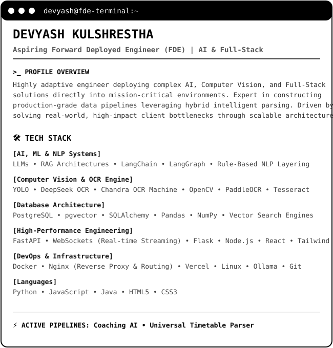

<div align="center">

# ⚡ DEVYASH KULSHRESTHA

```text
devyash@fde-terminal:~ $ ./initialize_pipeline.sh
```

[](https://github.com/devyash0010)
[](https://www.linkedin.com/)

<br>


<br>

```text
devyash@fde-terminal:~ $ whoami --fde-insights
```

<table>
<tr>
<td valign="top" width="45%">

</td>
<td valign="top" width="55%">

</td>
</tr>
</table>

<br>

```text
devyash@fde-terminal:~ $ cat profile_manifesto.md
```

### 🧠 Forward Deployed Systems Engineering
> Highly adaptive engineer specializing in deploying complex **AI, Computer Vision, and Full-Stack pipelines** directly into mission-critical, production environments. Expert at engineering hybrid intelligent text extraction systems that combine state-of-the-art multimodal vision models with precise programmatic guardrails.

---

```text
devyash@fde-terminal:~ $ ls -la --tree ./production_pipelines
```

### 🛠️ Core Architectural Stack

| Layer | Technologies & Frameworks |
| :--- | :--- |
| **🤖 AI Engineering** | `LLMs` `RAG Architectures` `Custom Embeddings` `LangChain` `LangGraph` |
| **👁️ Vision & NLP** | `YOLO (Object Detection)` `Rule-Based NLP Layering` `DeepSeek OCR` `Chandra OCR` `OpenCV` |
| **🌐 High-Performance Backend** | `FastAPI (Asynchronous)` `WebSockets (Real-time Streaming)` `Flask` `Node.js` |
| **🗄️ Relational & Vector Storage** | `PostgreSQL` `pgvector` `SQLAlchemy` `High-Dimensional Vector Search` |
| **📊 Data & Analytics Engineering**| `Pandas` `NumPy` `Advanced Feature Engineering` `Mathematical Profiling` |
| **⚙️ Infrastructure & DevOps** | `Docker (Microservices)` `Nginx (Reverse Proxy & Routing)` `Vercel` `Ollama` `Linux` |
| **💻 Core Code Languages** | `Python` `JavaScript` `Java` `HTML5` `CSS3` `Tailwind CSS` |

---

```text
devyash@fde-terminal:~ $ active-deployments --status
```

### 🚀 Mission Featured Deployments

*   **🤖 Coaching AI** 
    *   *System:* AI-powered coaching analytics engine and intelligent student performance metric platform.
    *   *Impact:* Leverages predictive profiling vectors to automate performance assessment loops.
*   **📄 Universal Timetable Parser**
    *   *System:* Highly optimized automated multi-format university timetable data extraction pipeline.
    *   *Impact:* Substitutes manual scheduling parsing with high-throughput relational mappings.
*   **🔎 Document Intelligence Matrix**
    *   *System:* Production OCR pipeline combining hybrid layout understanding engines and text extraction.
    *   *Impact:* Features deterministic token confidence filtering thresholds for automated data ingestion.

---

```text
devyash@fde-terminal:~ $ cat system_benchmarks.log
```

### 🔭 Current Focus & Latency Metrics

```text
[████████████████████░░]  Stateful Agent Workflows (LangGraph) 
[██████████████████░░░░]  Real-Time WebSocket Ingestion Loops  
[█████████████████░░░░░]  Containerized Microservices (Docker) 
[███████████████░░░░░░░]  Nginx Dynamic Traffic Optimization   
[██████████████░░░░░░░░]  Deep Learning Feature Engineering    
```

---

```text
devyash@fde-terminal:~ $ ./verify_achievements.sh
```

### 🏆 Verified Certifications
*   🎓 **Oracle AI Vector Search Professional Certification**

---

```text
devyash@fde-terminal:~ \$ exit
```

⚡ **System operational. Feel free to explore my source repositories or initiate a pipeline fork.**

</div>
